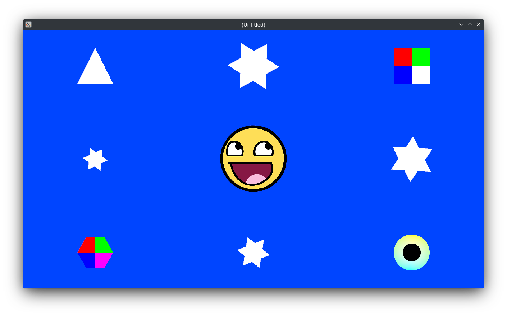

# Vulkify

[](https://github.com/vulkify/vulkify/actions/workflows/ci.yml)

## A lightweight 2D graphics framework



Inspired by [SFML](https://github.com/SFML/SFML), powered by Vulkan and C++20.

## Features

- [x] No binary dependencies: builds **everything** from source
  - [x] Self contained deps (no downloads in build scripts)
- [x] Dedicated fullscreen, borderless, and decorated windows
- [x] sRGB / linear framebuffers
- [x] Stall-less swapchain recreation
- [x] Custom cursors / window icons
- [x] Pipeline state customization: 
  - Polygon mode, primitive topology, line width
- [x] Instanced draws
- [x] Textures, Images, Bitmaps
- [x] Customizable viewport
- [x] Multi-monitor support
- [x] Multi-sampled anti-aliasing (MSAA)
- [x] Custom (fragment) shader support
  - [x] Custom descriptor set
  - [ ] Custom uniform buffer
  - [ ] Custom texture
- [x] Shape outlines
- [x] Cursor unprojection
- [x] TrueType Fonts
- [x] Bulk command buffer recording
- [ ] Text

## Requirements

- CMake 3.17+
- C++20 compiler and standard library
- Vulkan 1.1+
- Desktop windowing system/manager
  - Windows 10
  - X11 / Wayland (untested)
  - Raspbian (aarch64)

## Usage

Refer to [quick_start.cpp](examples/quick_start.cpp) for currently working code. Documentation and README are WIPs.

## API

### Introduction

A `vf::Context` owns and manages all resources, including windowing (GLFW) and graphics (Vulkan device, queue, surface, swapchain, etc). There may only be one context active at a time (creation of a duplicate will fail), and all resources are invalidated with it being destroyed. It uses an `Instance` (abstract) to drive the underlying systems, and while a const reference to it may be obtained through the context, its state cannot be changed except by the context itself. `Builder` can be used to customize and create both a context and its instance.

```cpp
auto context = vf::Builder{}/*.[setOptions()...]*/.build();
if (!context) { /* handle error* */ }
// use *context...
```

>_*Note:* `HeadlessInstance` / `InstanceFlag::eHeadless` is designed to use nothing and auto-close after a specified period of time (for automation)._

Most end-user types require an active context (and instance) to be activated themselves, most of which can be default constructed (as inactive). Some low level types may take a const reference to `Vram` in their constructors, which is an opaque type (not exposed outside the library), and can be obtained via `context.vram()`.

### FAQ

**Why does everything need a `Context`?**

Because it owns the active resources like GLFW Window, Vulkan device, queue, surface, swapchain, images, buffers, pipelines, descriptor sets, etc.

**But there can only be one `Context`...**

I would rather require dependency injection than use owning globals. :)

## External Dependencies

- [GLFW](https://github.com/glfw/glfw)
- [glm](https://github.com/g-truc/glm)
- [stb](https://github.com/nothings/stb)
- [VulkanHPP](https://github.com/KhronosGroup/Vulkan-Hpp)
- [Vulkan Memory Allocator](https://github.com/GPUOpen-LibrariesAndSDKs/VulkanMemoryAllocator)
- [freetype](https://github.com/freetype/freetype)
- [ktl](https://github.com/karnkaul/ktl)

[Original repository](https://github.com/vulkify/vulkify)

[LICENCE](LICENSE)
